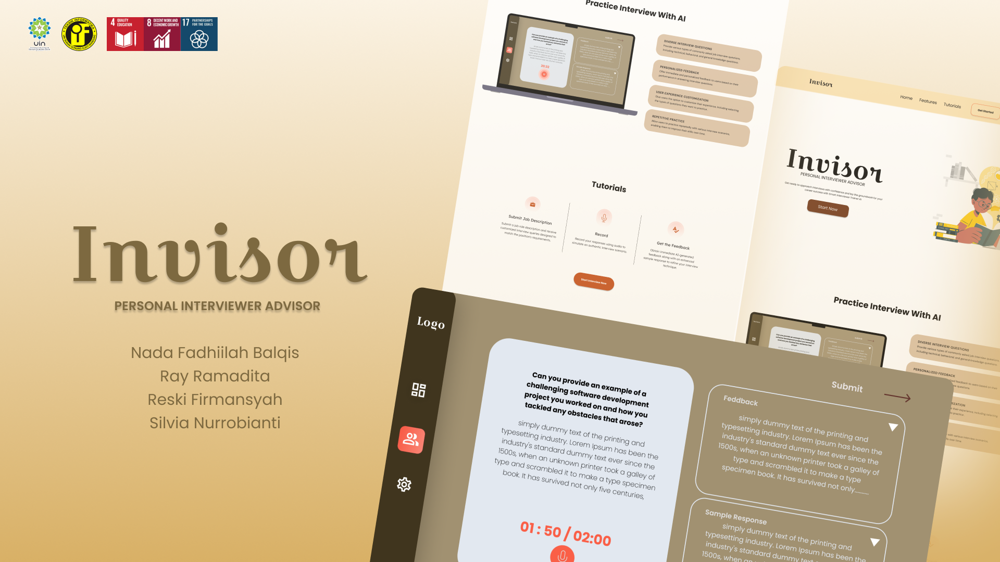
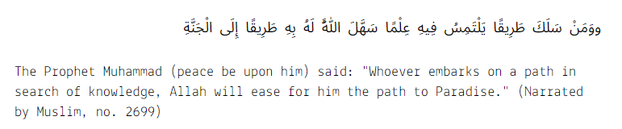

[](https://smart-interviewer.vercel.app/)

[Read Our Paper](https://drive.google.com/file/d/1y0fMH1xH9wfs5VIiYUoYzCFcPwf1HfHq/view?usp=drivesdk)

# INVISOR - Personal Interview Advisor

**INVISOR** aims to improve students' interview skills and communication to increase their employability. It aligns with several United Nations Sustainable Development Goals (SDGs) by providing students with the necessary skills to compete in the workforce and contribute to a more inclusive job market. The project will develop an AI-powered interview training platform that provides personalized feedback and allows students to practice answering common interview questions.

## How this project relates to SDGs

- **SDG 4: Quality Education** - Our project fosters inclusive education by equipping learners with essential interview skills, enhancing employability, and promoting equitable opportunities in the workforce.
- **SDG 8: Decent Work and Economic Growth** - We support SDG 8 by empowering students with interview skills, fostering economic growth through enhanced employability, and advancing a more inclusive job market.
- **SDG 17: Partnerships for the Goals** - The project emphasizes global collaboration for sustainable development, utilizing AI technology to create an innovative solution. Future partnerships with various organizations aim to enhance accessibility and benefit students globally.

## Topic and Motivation

The application of artificial intelligence (AI) in guiding multilingual job interviews has become a significant topic in human resource development. In this context, it is important to understand how the principles of artificial intelligence can be applied wisely to enhance interview skills and expand global employment opportunities. This study will explore the potential use of AI in conducting job interviews by considering perspectives from the Quran and Hadith on education, communication, and job opportunities.

<div style='align-items:center; justify-content:center'>
<h5>At-Tawbah:105</h5>

<h5>Hadith Muslim no. 2699</h5>
  
</div>

## Technologies Used

- [Flask](https://flask.palletsprojects.com/)
- [Langchain](https://www.langchain.com/)
- [Transformer & Sentence Transformers](https://github.com/UKPLab/sentence-transformers)
- [Fine-tuned gemma-1.1-2b-it (Text Generation) Model with Multilingual dataset (Indonesian, English)](https://huggingface.co/google/gemma-1.1-2b-it)
- [Next.js](https://nextjs.org/)
- [Tailwind CSS](https://tailwindcss.com/)

## Promotion Video
```
https://www.instagram.com/reel/C63pSIXvWr0/?igsh=MWgxeTAzb2Q3ZzR2NQ==
```

## Capstone Project Proposal
[Capstone Project Proposal Invisor](https://github.com/RayRama/invisor-machine-learning/blob/main/Capstone%20Project%20Proposal%20Invisor.pdf)

## Capstone Project Magazine
[Capstone Project Magazine Invisor](https://heyzine.com/flip-book/4d26bd577d.html)

## Our Team
- Nada Fadhiilah Balqis (1217050107)
- Ray Ramadita (1217050117)
- Reski Firmansyah (1217050119)
- Silvia Nurrobianti (1217050133)

---

## References

We provide a list of journal articles, conference papers, and other resources that have inspired our project:

- B. C. Lee and B. Y. Kim, “Development of an AI-based interview system for remote hiring,” International Journal of Advanced Research in Engineering and Technology (IJARET), vol. 12, no. 3, pp. 654–663, 2021.
- A. Heimerl et al., “Generating personalized behavioral feedback for a virtual job interview training system through adversarial learning,” in International Conference on Artificial Intelligence in Education, Springer, 2022, pp. 679–684.
- R. Panwar, “AI-ENABLED INTERVIEW ANALYSIS: UNVEILING INSIGHTS AND ENHANCING DECISION-MAKING IN HUMAN RESOURCE MANAGEMENT,” INTERANTIONAL JOURNAL OF SCIENTIFIC RESEARCH IN ENGINEERING AND MANAGEMENT, vol. 07, no. 05, Jun. 2023, doi: 10.55041/IJSREM24357.
- K. Yadav, A. Seemendra, A. Singhania, S. Bora, P. Dubey, and V. Aggarwal, “Interviewing the Interviewer: AI-generated Insights to Help Conduct Candidate-centric Interviews,” in Proceedings of the 28th International Conference on Intelligent User Interfaces, New York, NY, USA: ACM, Mar. 2023, pp. 723–736. doi: 10.1145/3581641.3584051.
- B. Liu, L. Wei, M. Wu, and T. Luo, “Speech production under uncertainty: how do job applicants experience and communicate with an AI interviewer?,” Journal of Computer- Mediated Communication, vol. 28, no. 4, Jun. 2023, doi: 10.1093/jcmc/zmad028.
- N. Boudjani, V. Colas, C. Joubert, and D. Ben Amor, “AI Chatbot For Job Interview,” in 2023 46th MIPRO ICT and Electronics Convention (MIPRO), IEEE, May 2023, pp. 1155–1160. doi: 10.23919/MIPRO57284.2023.10159831.
- J. Siswanto, S. Suakanto, M. Andriani, M. Hardiyanti, and T. F. Kusumasari, “Interview Bot Development with Natural Language Processing and Machine Learning,” International Journal of Technology, vol. 13, no. 2, p. 274, Apr. 2022, doi: 10.14716/ijtech.v13i2.5018.
- P. Kothari, P. Mehta, S. Patil, and V. Hole, “InterviewEase: AI-powered interview assistance,” 2024.
- A. H. Babu and N. Girikesh, “Creating an AI-driven interview platform tailored for remote hiring.,” 2024.
- A. Kanazawa et al., “Evaluation of a Medical Interview-Assistance System Using Artificial Intelligence for Resident Physicians Interviewing Simulated Patients: A Crossover, Randomized, Controlled Trial,” Int J Environ Res Public Health, vol. 20, no. 12, p. 6176, Jun. 2023, doi: 10.3390/ijerph20126176.
